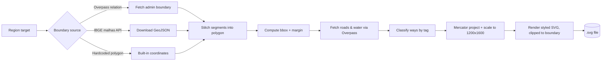

# maps-generator

Render Brazilian regional maps to standalone SVG from OpenStreetMap and IBGE data. A small collection of self-contained Python scripts that fetch administrative boundaries and road/water networks, project them with Web Mercator, and draw styled, clipped SVG maps.

[](LICENSE) [](https://www.python.org)

Covered regions include Minas Gerais and Sao Paulo states, the Zona da Mata mesoregion, the UFJF campus, Juiz de Fora and its neighborhoods, and the Paraiso do Morumbi area. Each script is independent; there is no shared library.

## Features

- **Overpass fetch with failover.** Pulls administrative boundaries and highways/waterways from the OpenStreetMap [Overpass API](https://overpass-api.de), failing over between two mirrors with retry/backoff on HTTP 429/504.
- **IBGE boundary download.** `gen_ibge_zona_mata.py` fetches the Zona da Mata mesoregion boundary (code 3112) directly from the IBGE malhas API as GeoJSON.
- **Boundary stitching.** Stitches multi-segment relation boundaries into closed polygons.
- **Web Mercator projection.** Projects all coordinates, then auto-scales and centers them into a fixed 1200x1600 canvas.
- **Tag classification.** Classifies ways into major, secondary, and residential roads, footpaths and buildings (UFJF only), water areas, and waterways, each with its own SVG style.
- **Boundary clipping.** Clips roads and water to the region boundary via an SVG `clipPath`.
- **Bbox splitting.** Splits large bounding boxes into halves or quadrants to keep Overpass queries within timeout limits.

## How it works



Boundaries come from one of three sources depending on the script: live Overpass administrative relations, the IBGE malhas API, or coordinate polygons hardcoded in the script.

## Requirements

- Python 3.x
- The [`requests`](https://pypi.org/project/requests/) package (the only third-party dependency; everything else is standard library).
- Network access to the Overpass API mirrors and, for the Zona da Mata script, the IBGE malhas API.

```powershell
pip install requests
```

## Usage

The scripts read no flags; the only inputs some accept are positional target names. Run them from inside the `scripts/` directory, because several write their output to a sibling `..\svg\` folder.

```powershell
cd scripts
```

Generate the default Minas Gerais / Zona da Mata set (MG state, SP state, Juiz de Fora, Cataguases, Zona da Mata, JF neighborhoods):

```powershell
python gen_mg_maps.py
```

Generate only specific targets by passing their names:

```powershell
python gen_mg_maps.py mg jf zona_da_mata
```

Available `gen_mg_maps.py` targets: `mg`, `sp_state`, `jf`, `cataguases`, `zona_da_mata`, `dom_bosco`, `sao_mateus`, `vale_ipe`, `haidee`.

Generate the Sao Paulo city / Zona Sul / Morumbi / Paraiso / Campinas set:

```powershell
python generate_maps.py
python generate_maps.py saopaulo morumbi paraiso
```

Available `generate_maps.py` targets: `saopaulo`, `zonasul`, `morumbi`, `paraiso`, `campinas`.

Generate the standalone single-region maps (no arguments):

```powershell
python gen_ibge_zona_mata.py
python gen_ufjf.py
python gen_paraiso_v3.py
python generate_paraiso.py
```

`gen_mg_maps.py`, `gen_ufjf.py`, and `gen_ibge_zona_mata.py` write into `..\svg\`, so that folder must exist (`mkdir ..\svg`). `generate_maps.py`, `gen_paraiso_v3.py`, and `generate_paraiso.py` write into the current directory.

## Output

Each run writes one or more `.svg` files (1200x1600, white background, OpenStreetMap/IBGE attribution in the subtitle).

| Script | Output file(s) |
|---|---|
| `gen_mg_maps.py` | `mg_map.svg`, `sp_state_map.svg`, `jf_map.svg`, `cataguases_map.svg`, `zona_da_mata_map.svg`, `jf_dom_bosco_map.svg`, `jf_sao_mateus_map.svg`, `jf_vale_ipe_map.svg`, `cataguases_haidee_map.svg` |
| `generate_maps.py` | `saopaulo_map.svg`, `zonasul_map.svg`, `morumbi_map.svg`, `paraiso_morumbi_map.svg`, `campinas_map.svg` |
| `gen_ibge_zona_mata.py` | `zona_da_mata_map.svg` |
| `gen_ufjf.py` | `ufjf_map.svg` |
| `gen_paraiso_v3.py`, `generate_paraiso.py` | `paraiso_morumbi_map.svg` |

Generated SVGs are gitignored (`svg/*.svg`); regenerate them with the scripts.

## Project structure

```
maps-generator/
  scripts/
    gen_mg_maps.py              # MG/SP states, JF, Cataguases, Zona da Mata, JF neighborhoods
    generate_maps.py            # Sao Paulo city, Zona Sul, Morumbi, Paraiso, Campinas
    gen_ibge_zona_mata.py       # Zona da Mata via IBGE malhas API (code 3112)
    gen_ufjf.py                 # UFJF campus with buildings and footpaths
    gen_paraiso_v3.py           # Paraiso do Morumbi, Google Maps-traced polygon
    generate_paraiso.py         # Paraiso do Morumbi, GeoSampa OD-zone polygon
    sp_state_ibge_boundary.json # Vendored IBGE Sao Paulo boundary dataset
  LICENSE
  README.md
```

## License

MIT. See [LICENSE](LICENSE).
